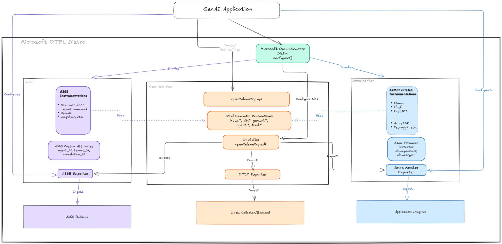

# Microsoft OpenTelemetry Distro — POC

## Architecture



This project is a **proof of concept** for the [`microsoft-opentelemetry`](https://github.com/Azure/azure-sdk-for-python/tree/main/sdk/monitor/microsoft-opentelemetry) Python package — a unified OpenTelemetry distribution that simplifies observability onboarding for both **Azure Monitor** and **Microsoft Agent 365 (A365)** customers.

It uses a real Agent Framework agent as the workload to demonstrate the difference between configuring observability manually vs. using the distro.

## The Problem

Today, setting up full observability for an A365 agent requires:

- Manually creating a `TracerProvider` via A365 `configure()`
- Individually initializing 4+ instrumentors (`AgentFrameworkInstrumentor`, `OpenAIAgentsTraceInstrumentor`, `SemanticKernelInstrumentor`, `CustomLangChainInstrumentor`)
- Managing dependency version checks (`skip_dep_check=True`)
- Handling token caches for the A365 exporter
- Configuring loggers separately
- **~250 lines of boilerplate** (see [`observability_config.py`](observability_config.py))

## The Solution

The `microsoft-opentelemetry` distro replaces all of that with **a single function call**:

```python
from microsoft.opentelemetry import configure_microsoft_opentelemetry

configure_microsoft_opentelemetry(
    enable_a365_agentframework_instrumentation=True,
    enable_a365_openai_instrumentation=True,
    enable_a365_semantickernel_instrumentation=True,
    enable_a365_langchain_instrumentation=True,
)
```

See [`microsoft_distro_observability_config.py`](microsoft_distro_observability_config.py) — **~60 lines** for the same functionality.

## Project Structure

| File | Purpose |
|---|---|
| `observability_config.py` | **A365 manual approach** — ~250 lines, manual TracerProvider setup, 4 separate instrumentor initializations |
| `microsoft_distro_observability_config.py` | **Microsoft Distro approach** — ~60 lines, single `configure_microsoft_opentelemetry()` call |
| `instrumentation_span_processor.py` | Shared `SpanProcessor` that stamps every span with instrumentation metadata (used by both approaches) |
| `token_cache.py` | Token cache for A365 exporter authentication (shared) |
| `agent.py` | Agent Framework agent using Azure OpenAI |
| `host_agent_server.py` | aiohttp server hosting the agent on port 3978 |
| `vendor/` | Vendored `microsoft-opentelemetry` wheel (pre-release, not yet on PyPI) |

## What the Distro Handles

- **Exporters**: Azure Monitor, OTLP, and A365 — enabled via parameters or environment variables
- **A365 Instrumentations** (span enrichment & bridging):
  - `AgentFrameworkInstrumentor` — enriches existing AgentFramework spans (normalizes attributes)
  - `OpenAIAgentsTraceInstrumentor` — bridges OpenAI Agents SDK traces → OTel spans
  - `SemanticKernelInstrumentor` — enriches SK spans (normalizes naming)
  - `CustomLangChainInstrumentor` — bridges LangChain callbacks → OTel spans
- **GenAI OTel Instrumentations**: OpenAI, OpenAI Agents, LangChain (community contrib)
- **Standard Instrumentations**: Django, FastAPI, Flask, requests, urllib3, psycopg2

## Prerequisites

- Python 3.11+
- Azure OpenAI API credentials (API key or Azure Identity)

## Quick Start

1. **Clone and install**:
   ```bash
   git clone https://github.com/hectorhdzg/microsoft-opentelemetry-poc.git
   cd microsoft-opentelemetry-poc
   python -m venv .venv
   .venv/Scripts/activate   # Windows
   # source .venv/bin/activate  # Linux/macOS
   pip install -e .
   ```

2. **Configure environment** — copy `.env.template` to `.env` and fill in your Azure OpenAI credentials:
   ```bash
   cp .env.template .env
   # Edit .env with your AZURE_OPENAI_API_KEY, AZURE_OPENAI_ENDPOINT, AZURE_OPENAI_DEPLOYMENT
   ```

3. **Run the agent**:
   ```bash
   python start_with_generic_host.py
   ```

4. **Test with Agents Playground**:
   ```bash
   winget install Microsoft.M365AgentsPlayground
   ```
   Connect the Playground to `http://localhost:3978/api/messages`.

## Switching Between Approaches

In [`host_agent_server.py`](host_agent_server.py), change the import:

```python
# A365 manual approach (~250 lines of setup)
from observability_config import setup_observability

# Microsoft Distro approach (~60 lines of setup)
from microsoft_distro_observability_config import setup_observability
```

Both expose the same `setup_observability()` API — it's a drop-in swap.

## Environment Variables

| Variable | Purpose |
|---|---|
| `AZURE_OPENAI_API_KEY` | Azure OpenAI API key |
| `AZURE_OPENAI_ENDPOINT` | Azure OpenAI endpoint URL |
| `AZURE_OPENAI_DEPLOYMENT` | Model deployment name (e.g., `gpt-4.1`) |
| `ENABLE_INSTRUMENTATION=true` | Turns on span creation in AgentFramework SDK |
| `ENABLE_SENSITIVE_DATA=true` | Include message content in spans |
| `APPLICATIONINSIGHTS_CONNECTION_STRING` | Azure Monitor (optional) |
| `ENABLE_A365_EXPORTER=true` | Send spans to A365 cloud backend (optional) |

## License

Copyright (c) Microsoft Corporation. All rights reserved.
Licensed under the MIT License.